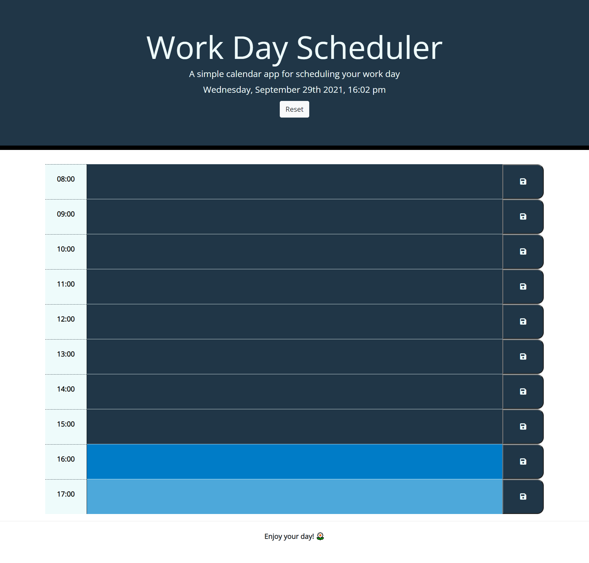

# work-day-scheduler

## This is a simple calendar app for you to schedule your busy work day.

* When you open this app, the current day is displayed at the top of the calendar.

* Your are presented with timeblocks for standard business hours.

* Each timeblock is color coded to indicate whether it is in the past, present, or future.

* To enter an event, just simply click the timeblock, and you can save this event by clicking the save button
(please note, information will NOT be saved if you forget to click the save button).

* The saved event is persist when you refresh the page, but you can click "Reset" button if you want to clear all the information in the blocks.

### App demo  https://sherryzheng2018.github.io/work-day-scheduler/
